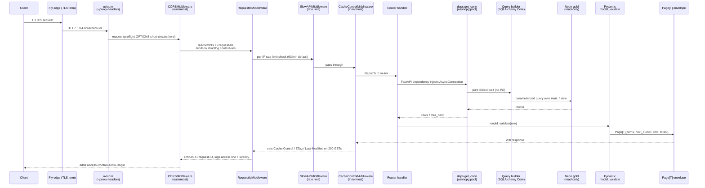
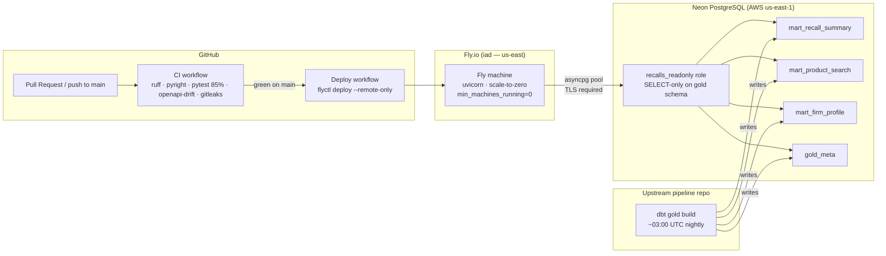

Purpose: describe the system shape of this API — what it is, what it sits on top of, how a request moves through it, and how the layers are organized.

# Architecture

This is a read-only FastAPI service that exposes five consumer-product-recall data sources (CPSC, FDA, USDA, NHTSA, USCG) via a small set of JSON endpoints (keyset-paginated entity lists plus bare-array `/stats/*` aggregates). It **owns no schema and writes nothing**: the upstream pipeline materializes three gold serving marts (plus the aggregate `fct_*` marts and `gold_meta`) into Neon PostgreSQL, and this service reads them through a single `recalls_readonly` role. See [data_contract.md](data_contract.md) for the full API-side view of that read contract and [operations.md](operations.md) for the production runtime and runbook.

---

## Request Lifecycle

Middleware is registered inner-first in `main.py` so the **last-added wrapper is outermost** on ingress — `CORSMiddleware` is added last, so it wraps the whole stack (see [decisions/0014-open-cors-public-read-only-api.md](decisions/0014-open-cors-public-read-only-api.md)).

---

## Component / Layer Responsibilities

| Module | Path | Responsibility |
|---|---|---|
| `main` | `src/recalls_api/main.py` | `create_app()` factory: registers middleware (inner-first; `CORSMiddleware` outermost), error handlers, routers, lifespan (pool open/close, fail-loud settings validation at boot) |
| `settings` | `src/recalls_api/settings.py` | `pydantic-settings` `Settings`; `get_settings()` is `lru_cache(maxsize=1)` — constructed once at boot; missing `NEON_DATABASE_URL_RO` raises `ValidationError` immediately |
| `routers` | `src/recalls_api/routers/` | Five FastAPI routers (`health`, `recalls`, `products`, `firms`, `stats`); own no SQL; call query builders + pagination helpers; declare `responses=` error maps |
| `deps` | `src/recalls_api/deps.py` | `RecallFilters` and `PaginationParams` as FastAPI `Depends` dataclasses; `get_conn` dependency that yields one `AsyncConnection` per request from the pool |
| `queries` | `src/recalls_api/queries/` | Pure `Select`-building functions (`recalls.py`, `products.py`, `firms.py`, `stats.py`); stateless; never hold a connection; reference mart + `fct_*` tables as lightweight SQLAlchemy Core literals |
| `models` | `src/recalls_api/models/` | Pydantic v2 response models (`common.py`, `recalls.py`, `products.py`, `firms.py`, `stats.py`, plus `descriptions.py` for shared field-description constants); `Source`/`DistributionScope` + the `/stats` enums (`StatsSource`/`Grain`/`GeographyBasis`); `Page[T]` envelope |
| `pagination` | `src/recalls_api/pagination.py` | `Cursor` (frozen dataclass): base64url JSON encode/decode; raises `BadCursor` (HTTP 400) on tamper or wrong arity; `date_keyset_where()` (recalls list event_date `e` + products published_at `p`) and `rank_keyset_where()` seek-WHERE builders; `slice_page()` (limit+1 pattern) |
| `db` | `src/recalls_api/db.py` | `make_engine()` (asyncpg pool, pool_size=5, max_overflow=5, pool_recycle=300 s, connect_timeout=5 s, command_timeout=10 s, `default_transaction_read_only=on` session setting, UTC timezone); `open_pool()` lifespan boot check (`SHOW transaction_read_only`); `healthcheck()` (`SELECT 1`); `get_conn()` dependency |
| `errors` | `src/recalls_api/errors.py` | `ApiError` hierarchy (4 subtypes); `ErrorEnvelope` wire shape; `LIST_ERRORS` / `ITEM_ERRORS` prebuilt `responses=` dicts; `register_error_handlers()` wires 8 handlers onto the app (ApiError, RequestValidationError, ResponseValidationError, four DB-exception types, and the catch-all) |
| `middleware` | `src/recalls_api/middleware.py` | `CacheControlMiddleware`: `Cache-Control: public, max-age=N` on 200 GETs; `no-store` on `/health*`; weak ETag + `Last-Modified` via `setdefault` |
| `logging` | `src/recalls_api/logging.py` | `configure_logging()` (structlog chain: JSON on stdout in prod, `ConsoleRenderer` on TTY/`LOG_FORMAT=console`); `RequestIdMiddleware` (reads/mints `X-Request-ID`, binds to structlog contextvars, echoes on response, logs access line) |

---

## Deploy Topology

The API sits entirely to the right of the dashed line between the pipeline and Neon: it reads gold, never writes it, and never joins across raw or silver layers.

---

## Cross-references

| Topic | Owner |
|---|---|
| Which mart columns the API reads, surrogate key recipes, data caveats (root causes) | [data_contract.md](data_contract.md) |
| Endpoint-by-endpoint params, response fields, status codes, curl examples | [api-reference.md](api-reference.md) |
| CI→deploy pipeline, `fly.toml` settings, cold-start runbook, rollback | [operations.md](operations.md) |
| ADR index and individual design decisions | [decisions/README.md](decisions/README.md) |
