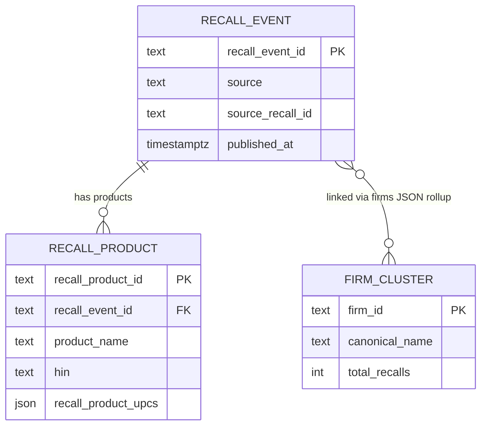

Purpose: the API-side view of the gold read contract — which marts the API reads, what it projects, how keys are computed, and the root causes of known data caveats.

> **Ownership:** the upstream pipeline owns the gold schema. The authoritative home for column definitions, index specs, and the contract itself is [pipeline ADR 0042](../../consumer-product-recalls/documentation/decisions/0042-gold-serving-marts-published-read-contract.md) and [pipeline documentation/data_schemas.md](../../consumer-product-recalls/documentation/data_schemas.md). This document owns only the API-side view: projections, key recipes, response-model mapping, and caveat root causes. Do not restate the full gold schema here.

---

## The API owns no schema

The `recalls-api` reads four dbt-materialized gold objects from the pipeline's Neon `main` branch via the `recalls_readonly` role. It holds no migrations and runs no DDL. All schema decisions live in the pipeline repo.

---

## Marts consumed

| Mart | Grain | Endpoints that read it | Key columns projected |
|---|---|---|---|
| `mart_recall_summary` | 1 row per recall event | `GET /recalls`, `GET /recalls/search`, `GET /recalls/{source}/{recall_id}` | See [list projection](#list-projection) and [detail projection](#detail-projection) below |
| `mart_product_search` | 1 row per recall product | `GET /products/search` | See [product projection](#product-projection) below |
| `mart_firm_profile` | 1 row per canonical firm cluster | `GET /firms/{firm_id}` | Full row — 16 columns including 3 JSON sidecar arrays |
| `gold_meta` | 1 row (build stamp) | Not yet consumed — planned for R6 (per-rebuild ETag); currently unused by the API | `rebuilt_at` (timestamptz), `schema_version` (text) |

### List projection

`GET /recalls` and `GET /recalls/search` project 18 columns from `mart_recall_summary` (`queries/recalls.py:_LIST_COLS`):

`recall_event_id`, `source`, `source_recall_id`, `title`, `url`, `announced_at`, `published_at`, `classification`, `risk_level`, `lifecycle_status`, `is_active`, `reason_category`, `distribution_scope`, `primary_firm_name`, `firm_count`, `product_count`, `edit_event_count`, `has_been_edited`.

`GET /recalls/search` adds a computed `rank` column (`ts_rank_cd` over `search_vector`).

### Detail projection

`GET /recalls/{source}/{recall_id}` selects the full row. Columns in addition to the list projection:

`recall_reason`, `corrective_action`, `consequence_of_defect`, `distribution_states` (scalar text), `distribution_state_codes` (text[]), `distribution_country_codes` (text[]), `hazards` (jsonb), `product_upcs` (jsonb), `product_names`, `models`, `hins`, `firms` (jsonb), `first_seen_at`, `last_seen_at`, `edit_count`, `is_currently_active`, `was_ever_retracted`.

### Product projection

`GET /products/search` selects 19 columns from `mart_product_search` (`queries/products.py:_HIT_COLS`):

`recall_product_id`, `recall_event_id`, `source`, `source_recall_id`, `product_name`, `product_description`, `model`, `type`, `model_year`, `hin`, `upc` (all-null — see caveat below), `recall_title`, `classification`, `risk_level`, `published_at`, `url`, `is_active`, `firm_name`, `recall_product_upcs`. The FTS (`q=`) path also returns a computed `rank`.

---

## Surrogate key recipes

### `recall_event_id`

Computed in the API at `GET /recalls/{source}/{recall_id}` (`queries/recalls.py:82–84`):

```python
hashlib.md5(f"{source.upper()}|{recall_id}".encode()).hexdigest()
```

This hits `UNIQUE(recall_event_id)` with no additional index. The source is always uppercased before hashing. Per-source `source_recall_id` business keys:

| Source | `source_recall_id` |
|---|---|
| `CPSC` | `RecallNumber` (e.g. `24-158`) |
| `FDA` | `recall_event_id::text` (integer RECALLEVENTID cast to text) |
| `USDA` | `field_recall_number` |
| `NHTSA` | `campno` |
| `USCG` | USCG Number |

The recipe is a wire-format invariant. A recipe change breaks all existing `GET /recalls/{source}/{id}` URLs. See [pipeline ADR 0042](../../consumer-product-recalls/documentation/decisions/0042-gold-serving-marts-published-read-contract.md) for the full list of load-bearing invariants.

### Canonical firm `firm_id`

The `firm_id` path parameter is an opaque 32-hex md5 cluster ID generated by the pipeline's cross-source firm crosswalk. Treat it as opaque — the API validates only the `^[0-9a-f]{32}$` shape. The recipe is owned by the pipeline.

### `recall_product_id`

An opaque cursor anchor generated per-source by the pipeline. Do not construct it client-side. It is stable across nightly rebuilds (CPSC was migrated to a stable `(event, ordinal)` anchor on branch `feature/pre-go-live-validation`).

---

## Response model to mart-column mapping

| Response model | Mart | Notes |
|---|---|---|
| `RecallSummary` | `mart_recall_summary` | 18-column list projection; `distribution_scope` is NOT NULL in the mart |
| `RecallSearchHit` | `mart_recall_summary` | `RecallSummary` + computed `rank: float` |
| `RecallDetail` | `mart_recall_summary` | Full row; `product_upcs`, `product_names`, `models`, `hins`, `firms` are left NULL by the mart when empty; the API `_none_to_list` validator (`models/recalls.py:104`) coerces them to `[]` at the response layer. (`hazards` is not coerced and may remain null.) |
| `ProductSearchHit` | `mart_product_search` | 19 mart columns + optional computed `rank`; `upc_is_recall_level: True` is a synthetic API field (not a mart column) |
| `FirmProfile` | `mart_firm_profile` | Full row; `firm_usda_attributes`, `firm_uscg_attributes`, `firm_fda_attributes` are JSON arrays of agency registration sidecars |

See [api-reference.md](api-reference.md) for the per-endpoint field tables.

---

## Entity relationships (conceptual)



`mart_product_search` is the product grain — one row per `recall_product`, joined back to recall-level context. `mart_firm_profile` is the firm grain — one row per canonical cluster; firms are linked to recall events via the `firms` JSON array in `mart_recall_summary` (a pre-joined rollup, not a separate join table in the API).

---

## Data caveats — root causes

These are the root causes. Per-endpoint consequences and user-facing wording live in [api-reference.md](api-reference.md).

### `is_active` is tri-state (`true` / `false` / `null`)

CPSC and NHTSA carry no native lifecycle status field. `is_active` is derived only where a source provides an equivalent: FDA `phase_txt`, USDA `recall_type`, USCG `disposition`. CPSC and NHTSA have no such input — their rows have `is_active = NULL` by design.

Consequence: `?is_active=true` silently excludes all CPSC and NHTSA rows. This is not a data gap; it reflects a genuine absence in the source agencies.

### `classification` is source-native, not a unified enum

Each agency names its hazard tiers independently: FDA/USDA use `Class I / II / III`; USCG uses `H / L / M / S`; CPSC and NHTSA have no classification field (NULL). A `Class I` recall from FDA is not the same tier as a `Class I` from USDA. The `?classification=` filter is exact-string equality and is meaningful only when combined with `?source=`.

This is a deliberate modeling choice (pipeline ADR 0036 D2 rejected a unified enum because the value spaces are disjoint).

### Recall-level UPC arrays vs. null per-product `upc`

The per-product `upc` column in `mart_product_search` is NULL for every row today — product-grain UPC extraction is not yet implemented in the pipeline. Recall-level UPCs (a recall-wide array, not per-product) are populated in `mart_recall_summary.product_upcs` and surfaced in `mart_product_search.recall_product_upcs`.

`GET /products/search?upc=` therefore runs JSONB containment on `recall_product_upcs`. A match means a recall lists that UPC at the recall level. A miss means no recall lists that UPC — not necessarily that the product was never recalled. The `upc_is_recall_level: true` field in `ProductSearchHit` signals this explicitly.

### `distribution_state_codes` / `distribution_country_codes` — FDA/USDA only; countries are foreign-only

The `recall_distribution_area` sidecar is populated only for FDA and USDA recalls with parseable US state codes or parseable foreign country codes. CPSC, NHTSA, and USCG carry no distribution area text field, so their `distribution_state_codes` and `distribution_country_codes` are NULL.

Country codes are intentionally foreign-only. `US` is excluded because nationwide/regional US distribution is already carried by `distribution_scope` and `distribution_state_codes`. Storing `US` in `distribution_country_codes` would duplicate a fact already present elsewhere.

### No fuzzy or typo-tolerant search

`pg_trgm` is not available on the Neon serverless instance (confirmed; pipeline ADR 0037 moved firm fuzzy-resolution to a Python stage for the same reason). Both `GET /recalls/search` and `GET /products/search` use `websearch_to_tsquery('english', ...)` — token and prefix matching only. A misspelled term returns zero results.
