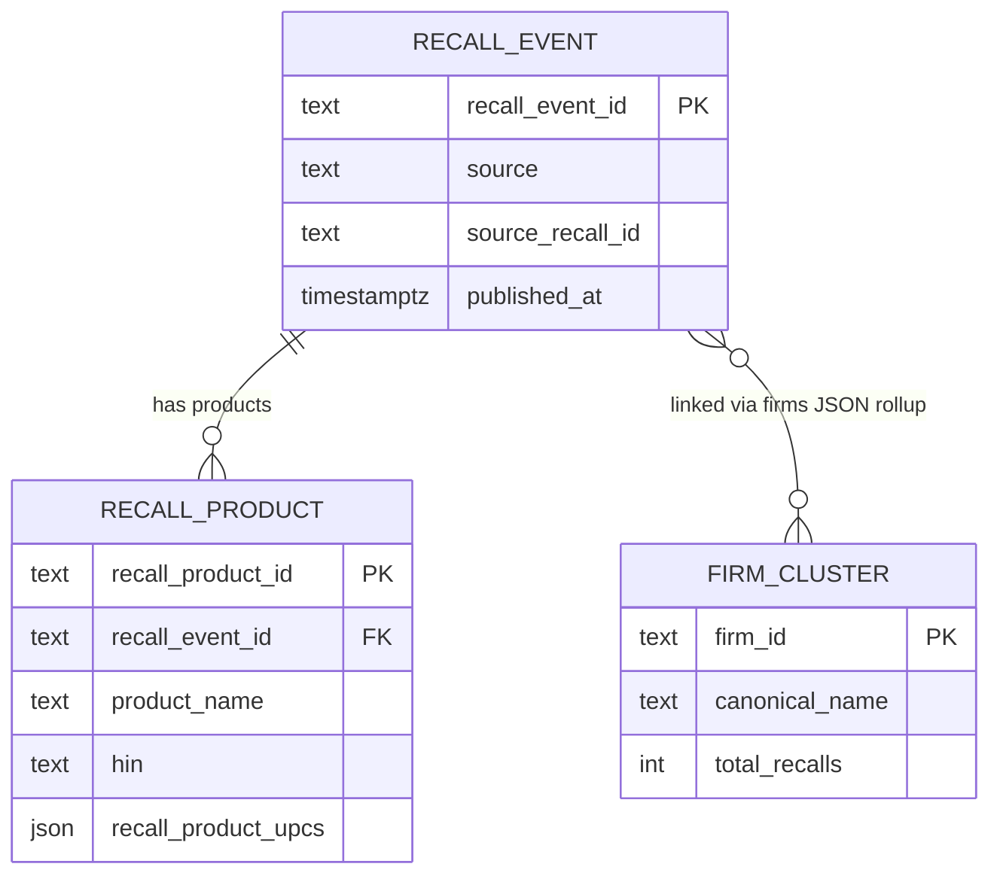

Purpose: the API-side view of the gold read contract — which marts the API reads, what it projects, how keys are computed, and the root causes of known data caveats.

> **Ownership:** the upstream pipeline owns the gold schema. The authoritative home for column definitions, index specs, and the contract itself is [pipeline ADR 0042](../../consumer-product-recalls/documentation/decisions/0042-gold-serving-marts-published-read-contract.md) and [pipeline documentation/data_schemas.md](../../consumer-product-recalls/documentation/data_schemas.md). This document owns only the API-side view: projections, key recipes, response-model mapping, and caveat root causes. Do not restate the full gold schema here.

---

## The API owns no schema

The `recalls-api` reads four dbt-materialized gold objects from the pipeline's Neon `main` branch via the `recalls_readonly` role. It holds no migrations and runs no DDL. All schema decisions live in the pipeline repo.

---

## Marts consumed

| Mart | Grain | Endpoints that read it | Key columns projected |
|---|---|---|---|
| `mart_recall_summary` | 1 row per recall event | `GET /recalls`, `GET /recalls/search`, `GET /recalls/{source}/{recall_id}` | See [list projection](#list-projection) and [detail projection](#detail-projection) below |
| `mart_product_search` | 1 row per recall product | `GET /products/search` | See [product projection](#product-projection) below |
| `mart_firm_profile` | 1 row per canonical firm cluster | `GET /firms/{firm_id}` | Full row — 16 columns including 3 JSON sidecar arrays |
| `gold_meta` | 1 row (build stamp) | `GET /stats/overview` (`last_rebuilt_at`) | `rebuilt_at` (timestamptz), `schema_version` (text) |
| `fct_*` (10 aggregate marts) | per-aggregate (period / source / firm / state / country / units) | `GET /stats/*` | small pre-aggregates read whole; `fct_recalls_by_{month,week,year,classification,firm,geography,country}`, `_monthly_trend`, `_recall_status`, `_units_recalled`. See [GET /stats/\*](api-reference.md#get-stats). |

### List projection

`GET /recalls` and `GET /recalls/search` project 17 columns from `mart_recall_summary` (`queries/recalls.py:_LIST_COLS`):

`recall_event_id`, `source`, `source_recall_id`, `title`, `url`, `announced_at`, `published_at`, `classification`, `risk_level`, `lifecycle_status`, `is_active`, `reason_category`, `distribution_scope`, `primary_firm_name`, `firm_count`, `product_count`, `has_been_edited`.

`GET /recalls/search` adds a computed `rank` column (`ts_rank_cd` over `search_vector`).

### Detail projection

`GET /recalls/{source}/{recall_id}` selects the full row. Columns in addition to the list projection:

`recall_reason`, `corrective_action`, `consequence_of_defect`, `distribution_states` (scalar text), `distribution_state_codes` (text[]), `distribution_country_codes` (text[]), `hazards` (jsonb), `product_upcs` (jsonb), `product_names`, `models`, `hins`, `firms` (jsonb).

> **Pipeline-observability fields are no longer projected (audit Q2 / provenance prune).** The mart still carries `first_seen_at`, `last_seen_at`, `edit_count`, `edit_event_count`, `is_currently_active`, and `was_ever_retracted` for the pipeline's own observability, but the API stopped serving them: they implied authoritative agency semantics they lack, several were null for most sources, and `is_currently_active` was easily confused with the lifecycle `is_active`. `has_been_edited` is kept as the single honest "revised since first ingest" signal. See the [per-source provenance matrix](#per-source-field-provenance) for the kept fields.

### Product projection

`GET /products/search` selects 18 columns from `mart_product_search` (`queries/products.py:_HIT_COLS`):

`recall_product_id`, `recall_event_id`, `source`, `source_recall_id`, `product_name`, `product_description`, `model`, `type`, `model_year`, `hin`, `recall_title`, `classification`, `risk_level`, `published_at`, `url`, `is_active`, `firm_name`, `recall_product_upcs`. The FTS (`q=`) path also returns a computed `rank`. (The mart's all-null per-product `upc` column is **not** projected — see the [caveat below](#recall-level-upc-arrays-vs-null-per-product-upc).)

---

## Surrogate key recipes

### `recall_event_id`

Computed in the API at `GET /recalls/{source}/{recall_id}` by `compute_recall_event_id()` (`queries/recalls.py`):

```python
hashlib.md5(f"{source.upper()}|{recall_id}".encode()).hexdigest()
```

This hits `UNIQUE(recall_event_id)` with no additional index. The source is always uppercased before hashing. Per-source `source_recall_id` business keys:

| Source | `source_recall_id` |
|---|---|
| `CPSC` | `RecallNumber` (e.g. `24-158`) |
| `FDA` | `recall_event_id::text` (integer RECALLEVENTID cast to text) |
| `USDA` | `field_recall_number` |
| `NHTSA` | `campno` |
| `USCG` | USCG Number |

The recipe is a wire-format invariant. A recipe change breaks all existing `GET /recalls/{source}/{id}` URLs. See [pipeline ADR 0042](../../consumer-product-recalls/documentation/decisions/0042-gold-serving-marts-published-read-contract.md) for the full list of load-bearing invariants.

### Canonical firm `firm_id`

The `firm_id` path parameter is an opaque 32-hex md5 cluster ID generated by the pipeline's cross-source firm crosswalk. Treat it as opaque — the API validates only the `^[0-9a-f]{32}$` shape. The recipe is owned by the pipeline.

`GET /recalls?firm_id={id}` filters recalls by that id via **jsonb containment** on `mart_recall_summary.firms` (`firms @> '[{"firm_id": :id}]'`, GIN-indexed upstream), matching the firm in **any** role — so it includes co-recalled/secondary firms (unlike `?firm=`, a substring on the primary firm name only). `mart_firm_profile` carries only aggregate firm stats (counts), not the recall list, which is why the firm's recalls are read from the recall grain.

### `recall_product_id`

An opaque cursor anchor generated per-source by the pipeline. Do not construct it client-side. It is stable across nightly rebuilds (CPSC was migrated to a stable `(event, ordinal)` anchor on branch `feature/pre-go-live-validation`).

---

## Response model to mart-column mapping

| Response model | Mart | Notes |
|---|---|---|
| `RecallSummary` | `mart_recall_summary` | 17-column list projection; `distribution_scope` is NOT NULL in the mart |
| `RecallSearchHit` | `mart_recall_summary` | `RecallSummary` + computed `rank: float` |
| `RecallDetail` | `mart_recall_summary` | Full row; `product_upcs`, `product_names`, `models`, `hins`, `firms` are left NULL by the mart when empty; the API `_none_to_list` validator on `RecallDetail` coerces them to `[]` at the response layer. (`hazards` is not coerced and may remain null.) |
| `ProductSearchHit` | `mart_product_search` | 18 mart columns + optional computed `rank`; `upc_is_recall_level: True` is a synthetic API field (not a mart column) |
| `FirmProfile` | `mart_firm_profile` | Full row; `firm_usda_attributes`, `firm_uscg_attributes`, `firm_fda_attributes` are JSON arrays of agency registration sidecars. The API coerces sidecar values at the response boundary: numeric identifiers (`zip`, `fips_code`, `establishment_id`, `mic`) to strings, and a null `prior_holders` to `[]`. |

See [api-reference.md](api-reference.md) for the per-endpoint field tables.

---

## Per-source field provenance

Which of the five agency feeds populates each exposed field. This is the at-a-glance human view; the machine-readable per-field definitions live in the OpenAPI `description` strings (the SSOT), which carry the same `Sources: …` tag. Empirically verified against the gold coverage audit (`provenance-analysis-2026-06-17.md`).

**Legend:** **Y** = the source populates this field with meaningful data · **–** = structurally null/empty for this source by construction · **n/a** = source-independent (synthesized, derived, or computed at query time — not attributable to one agency).

### `mart_recall_summary` — `RecallSummary` (list) & `RecallDetail` (detail)

| Field | CPSC | FDA | USDA | NHTSA | USCG | Notes |
|---|---|---|---|---|---|---|
| `recall_event_id` | Y | Y | Y | Y | Y | synthesized md5 PK |
| `source` | Y | Y | Y | Y | Y | closed enum discriminator |
| `source_recall_id` | Y | Y | Y | Y | Y | agency-native; FDA = RECALLEVENTID |
| `title` | Y | Y | Y | Y | Y | native CPSC/USDA; synthesized FDA/NHTSA/USCG |
| `url` | Y | – | Y | – | Y | FDA/NHTSA carry no per-recall URL |
| `announced_at` | Y | Y | Y | Y | Y | ~20 FDA events null (≥1940 guard) |
| `published_at` | Y | Y | Y | Y | Y | coalesced, NOT NULL, the sort key |
| `classification` | – | Y | Y | – | Y | native vocabularies, NOT normalized |
| `risk_level` | – | – | Y | – | – | USDA-only, derived from classification |
| `lifecycle_status` | – | Y | Y | – | Y | native vocabularies, NOT normalized |
| `is_active` | – | Y | Y | – | Y | tri-state; null = CPSC+NHTSA |
| `reason_category` | – | – | Y | – | – | USDA FSIS taxonomy |
| `recall_reason` | Y | Y | Y | Y | Y | free-text narrative |
| `corrective_action` | – | – | – | Y | – | NHTSA-only |
| `consequence_of_defect` | – | – | – | Y | – | NHTSA-only |
| `distribution_scope` | Y | Y | Y | Y | Y | conformed enum; CPSC/USCG/NHTSA are policy defaults |
| `distribution_states` | – | – | Y | – | – | USDA raw CSV scalar |
| `distribution_state_codes` | – | Y | Y | – | – | parsed USPS codes (FDA free-text + USDA list) |
| `distribution_country_codes` | – | Y | – | – | – | FDA-only in practice (foreign-only; US excluded) |
| `hazards` | Y | – | – | – | – | CPSC jsonb array |
| `product_upcs` | Y | – | – | – | – | CPSC-only, sparse (~5%) |
| `primary_firm_name` | Y | Y | Y | Y | Y | role-priority pick from the firm rollup |
| `firm_count` | Y | Y | Y | Y | Y | distinct firms |
| `firms` | Y | Y | Y | Y | Y | one element per (firm, role) |
| `product_count` | Y | Y | Y | Y | Y | USDA/USCG always 1 |
| `product_names` | Y | Y | Y | Y | Y | cross-source alias (desc/title/component) |
| `models` | – | – | – | Y | – | NHTSA MODELTXT only † |
| `hins` | – | – | – | – | Y | USCG Hull IDs |
| `has_been_edited` | n/a | n/a | n/a | n/a | n/a | synthesized edit-detection flag |

### `mart_product_search` — `ProductSearchHit`

| Field | CPSC | FDA | USDA | NHTSA | USCG | Notes |
|---|---|---|---|---|---|---|
| `recall_product_id` | Y | Y | Y | Y | Y | per-source md5 surrogate |
| `recall_event_id` | Y | Y | Y | Y | Y | parent-event md5 |
| `source` | Y | Y | Y | Y | Y | enum discriminator |
| `source_recall_id` | Y | Y | Y | Y | Y | FDA = productid (product-grain) |
| `product_name` | Y | Y | Y | Y | Y | cross-source alias |
| `product_description` | – | Y | Y | Y | Y | null for CPSC † |
| `model` | – | – | – | Y | – | NHTSA MODELTXT only † |
| `type` | Y | Y | Y | Y | Y | source-specific vocabularies, NOT harmonized |
| `model_year` | – | – | – | Y | Y | vehicle/vessel sources |
| `hin` | – | – | – | – | Y | USCG Hull IDs |
| `recall_title` | Y | Y | Y | Y | Y | from `mart_recall_summary.title` |
| `classification` | – | Y | Y | – | Y | from `mart_recall_summary` |
| `risk_level` | – | – | Y | – | – | from `mart_recall_summary` |
| `published_at` | Y | Y | Y | Y | Y | from `mart_recall_summary` |
| `url` | Y | – | Y | – | Y | from `mart_recall_summary` |
| `is_active` | – | Y | Y | – | Y | from `mart_recall_summary` |
| `firm_name` | Y | Y | Y | Y | Y | = `primary_firm_name` |
| `recall_product_upcs` | Y | – | – | – | – | CPSC-only, recall-level; the real UPC-search path |

`rank` (query-time `ts_rank_cd`) and `upc_is_recall_level` (constant `True`) are source-independent (n/a).

### `mart_firm_profile` — `FirmProfile`

| Field | CPSC | FDA | USDA | NHTSA | USCG | Notes |
|---|---|---|---|---|---|---|
| `firm_id` | Y | Y | Y | Y | Y | derived cross-source cluster key |
| `canonical_name` | Y | Y | Y | Y | Y | representative display name |
| `normalized_name` | Y | Y | Y | Y | Y | upper(trim()) of the representative, NOT unique |
| `observed_names` | Y | Y | Y | Y | Y | raw spellings collapsed together |
| `observed_company_ids` | – | Y | Y | – | Y | FDA FEI / USDA establishment number / USCG MIC |
| `alternate_names` | n/a | n/a | n/a | n/a | n/a | derived enrichment (firm crosswalk) |
| `total_recalls` | Y | Y | Y | Y | Y | distinct recalls, cross-source |
| `active_recalls` | – | Y | Y | – | Y | only FDA/USDA/USCG can be active |
| `first_recall_at` | Y | Y | Y | Y | Y | min(coalesce(announced_at, published_at)) — announce-date basis |
| `last_recall_at` | Y | Y | Y | Y | Y | max(coalesce(announced_at, published_at)) — announce-date basis |
| `roles` | Y | Y | Y | Y | Y | distinct roles |
| `recalls_by_source` | Y | Y | Y | Y | Y | sparse {source → count} object |
| `distinct_products` | Y | Y | Y | Y | Y | per-firm footprint (NOT global-distinct) |
| `firm_usda_attributes` | – | – | Y | – | – | USDA FSIS establishment sidecar |
| `firm_uscg_attributes` | – | – | – | – | Y | USCG MIC directory sidecar |
| `firm_fda_attributes` | – | Y | – | – | – | FDA FEI sidecar |

> **† Empty-string normalization.** The pipeline NULLs every free-text `''` (a source's "absent" marker) in silver, so `model` and `product_description` are now NHTSA-only / null-for-CPSC: CPSC supplies an empty string for these per-product fields, which the silver `nullif(trim(...), '')` converts to NULL (and the gold not-null rollup filter then drops). Before this normalization CPSC contributed a literal `""`. The matrix above reflects the post-normalization end state. See the [empty-string root cause](#empty-string-vs-null-for-free-text-fields) below.

---

## Entity relationships (conceptual)



`mart_product_search` is the product grain — one row per `recall_product`, joined back to recall-level context. `mart_firm_profile` is the firm grain — one row per canonical cluster; firms are linked to recall events via the `firms` JSON array in `mart_recall_summary` (a pre-joined rollup, not a separate join table in the API).

---

## Data caveats — root causes

These are the root causes. Per-endpoint consequences and user-facing wording live in [api-reference.md](api-reference.md).

### `is_active` is tri-state (`true` / `false` / `null`)

CPSC and NHTSA carry no native lifecycle status field. `is_active` is derived only where a source provides an equivalent: FDA `phase_txt`, USDA `recall_type`, USCG `disposition`. CPSC and NHTSA have no such input — their rows have `is_active = NULL` by design.

Consequence: `?is_active=true` silently excludes all CPSC and NHTSA rows. This is not a data gap; it reflects a genuine absence in the source agencies.

### `classification` is source-native, not a unified enum

Each agency names its hazard tiers independently: FDA/USDA use `Class I / II / III`; USCG uses `H / L / M / S`; CPSC and NHTSA have no classification field (NULL). A `Class I` recall from FDA is not the same tier as a `Class I` from USDA. The `?classification=` filter is exact-string equality and is meaningful only when combined with `?source=`.

This is a deliberate modeling choice (pipeline ADR 0036 D2 rejected a unified enum because the value spaces are disjoint).

### Recall-level UPC arrays vs. null per-product `upc`

The per-product `upc` column in `mart_product_search` is NULL for every row today — product-grain UPC extraction is not yet implemented in the pipeline. Because it carries no information, the API **no longer projects it** (audit A9); the column remains in the gold mart as a forward-looking placeholder. Recall-level UPCs (a recall-wide array, not per-product) are populated in `mart_recall_summary.product_upcs` and surfaced in `mart_product_search.recall_product_upcs`.

`GET /products/search?upc=` therefore runs JSONB containment on `recall_product_upcs`. A match means a recall lists that UPC at the recall level. A miss means no recall lists that UPC — not necessarily that the product was never recalled. The `upc_is_recall_level: true` field in `ProductSearchHit` signals this explicitly.

### `distribution_state_codes` / `distribution_country_codes` — FDA/USDA only; countries are foreign-only

The `recall_distribution_area` sidecar is populated only for FDA and USDA recalls with parseable US state codes or parseable foreign country codes. CPSC, NHTSA, and USCG carry no distribution area text field, so their `distribution_state_codes` and `distribution_country_codes` are NULL.

Country codes are intentionally foreign-only. `US` is excluded because nationwide/regional US distribution is already carried by `distribution_scope` and `distribution_state_codes`. Storing `US` in `distribution_country_codes` would duplicate a fact already present elsewhere.

### No fuzzy or typo-tolerant search

`pg_trgm` is not available on the Neon serverless instance (confirmed; pipeline ADR 0037 moved firm fuzzy-resolution to a Python stage for the same reason). Both `GET /recalls/search` and `GET /products/search` use `websearch_to_tsquery('english', ...)` — token and prefix matching only. A misspelled term returns zero results.

### Empty-string vs NULL for free-text fields

Several agencies emit an empty string (`''`) — not NULL — when a free-text field has no value. The silver layer normalizes these to NULL with `nullif(trim(...), '')` so "absent" is represented one way (NULL) everywhere, and the gold not-null rollup filters then drop them from the jsonb arrays.

The visible consequence in the API contract is two fields that are effectively NHTSA-only:

- **`model`** (`ProductSearchHit.model`, `RecallDetail.models[]`) — CPSC's `Products[].Model` is empty at source, so after normalization `model` is populated only by NHTSA (`MODELTXT`). Before normalization CPSC contributed a literal `""` that survived the not-null filter.
- **`product_description`** (`ProductSearchHit.product_description`) — CPSC's per-product description is empty at source, so after normalization it is null for CPSC and populated by FDA/USDA/NHTSA/USCG.

Other free-text fields (`product_name`, `type`, `recall_reason`, `corrective_action`, `consequence_of_defect`) also have blanks normalized to NULL, but those sources still carry real values for most rows, so their per-source provenance is unchanged. This normalization is upstream (pipeline silver models); the API contract above describes the post-normalization end state.
