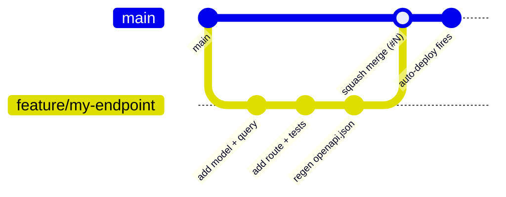

Purpose: Get a contributor productive locally and document the git workflow and how to extend the API.

---

## Prerequisites

| Tool | Version | Notes |
|---|---|---|
| Python | 3.12+ | Required by `requires-python` in `pyproject.toml` |
| [uv](https://docs.astral.sh/uv/) | latest | Dependency manager and task runner |
| Docker | any recent | Required for integration tests outside CI (testcontainers) |
| direnv | optional | Auto-loads `.env` into the shell; not required |

---

## Setup

```bash
# 1. Install exact locked dependencies
uv sync

# 2. Copy the env template and fill in your read-only Neon DSN
cp .env.example .env
# Edit .env — set NEON_DATABASE_URL_RO to your recalls_readonly DSN
# Example format (see .env.example for full notes):
#   NEON_DATABASE_URL_RO=postgresql+asyncpg://recalls_readonly:<password>@<host>/neondb?ssl=require

# 3. Install pre-commit hooks
uv run pre-commit install

# 4. Run the API locally with hot reload
uv run uvicorn --factory recalls_api.main:create_app --reload
```

The app starts on `http://localhost:8000`. Interactive docs are at `/docs` (Swagger UI) and `/redoc`.

`db.normalize_dsn()` in `db.py` accepts a plain Neon console DSN (starting `postgresql://`) and rewrites it to `postgresql+asyncpg://`, strips libpq-only query params, and forces TLS — so you can paste a DSN directly from the Neon console.

---

## Quality Gate

All six checks must be green before merging. CI runs them in this order:

```bash
uv run ruff check .                   # lint (E, F, I, UP, B, SIM, C4, PTH, RUF)
uv run ruff format --check .          # format (line-length 100; no auto-fix in CI)
uv run pyright                        # static types (standard mode, Python 3.12)
uv run pytest --cov-fail-under=85    # tests + 85% coverage floor
uv run python -m recalls_api.export_openapi --check  # OpenAPI snapshot drift
uv run pre-commit run --all-files     # gitleaks, uv.lock, etc.
```

Run `uv run ruff format .` locally to auto-fix formatting before committing. The `--cov-fail-under=85` floor is not in `pyproject.toml`'s `addopts` deliberately (so early scaffold commits are not blocked); it only engages in CI and when you pass it explicitly.

---

## Test Layout

```
tests/
  *.py                      # unit tests — no DB; use pytest fixtures and mocks
  integration/
    conftest.py             # DB fixture: TEST_DATABASE_URL → testcontainers postgres:16 → skip
    test_recalls.py
    test_products.py
    test_firms.py
    test_ops.py
  contract/
    test_openapi.py         # snapshot drift: committed openapi.json == live app output
  fixtures/
    seed_gold.sql           # DDL + INSERT cassette (mirrors gold mart shapes)
```

**Unit tests** (`tests/*.py`) have no DB dependency. They cover models, pagination cursor codec, query builders (constructed `Select` objects), error envelope, settings, and structlog configuration.

**Integration tests** (`tests/integration/`) spin up a real Postgres 16 instance seeded with `seed_gold.sql`, wire it into a running `create_app()` via `app.dependency_overrides`, and send HTTP requests through `httpx.AsyncClient` with `ASGITransport`. The DB resolution order (from `tests/integration/conftest.py`):

1. `TEST_DATABASE_URL` env var — used by CI's `postgres:16` service (set at `.github/workflows/ci.yml:34`).
2. testcontainers `postgres:16` — requires Docker running locally.
3. Skip — the unit suite still runs on machines without Docker.

**To run integration tests locally** (Docker must be running and your user must be in the `docker` group):

```bash
sg docker -c 'uv run pytest'
```

**Contract tests** (`tests/contract/test_openapi.py`) assert that the committed `openapi.json` snapshot exactly matches what `recalls_api.export_openapi.generate()` produces at runtime. A drift means you added or changed an endpoint without regenerating the snapshot (see the recipe below).

For the reasoning behind this three-tier structure, see [decisions/0009-testing-strategy-unit-integration-contract.md](decisions/0009-testing-strategy-unit-integration-contract.md) — it documents why unit/integration/contract are kept separate.

---

## Git Branching

Trunk is `main`. It is CI-gated and auto-deploys to Fly.io on every green push. See [operations.md](operations.md) for the deploy mechanics.



| Rule | Detail |
|---|---|
| Branch from `main` | `git checkout -b feature/<slug>` |
| Granular checklist | Keep the task breakdown in the draft-PR body; check off as you go |
| PR must be green | All six quality-gate checks must pass; no exceptions |
| Merge to `main` | Squash-merge; use the `feat(domain): description (#N)` commit convention |
| Auto-deploy | A green `main` triggers the `deploy.yml` workflow immediately — no manual step |

Small ops fixups (Actions pin updates, `fly.toml` tweaks) may be committed directly to `main`.

---

## How to Add an Endpoint

Follow these steps in order. Each step has a corresponding test expectation.

**1. Model** — add a Pydantic v2 response model in `src/recalls_api/models/`.

```python
# src/recalls_api/models/my_domain.py
from pydantic import BaseModel

class MyResource(BaseModel):
    id: str
    name: str | None = None
```

**2. Query builder** — add a pure SQLAlchemy Core builder in `src/recalls_api/queries/`. Return a `Select`; never hold a connection. For list endpoints, use the keyset cursor pattern from `pagination.py`:

```python
# src/recalls_api/queries/my_domain.py
import sqlalchemy as sa
from recalls_api.pagination import published_at_keyset_where, slice_page

_table = sa.table("mart_my_mart", sa.column("id"), sa.column("name"), sa.column("published_at"))

def list_stmt(cursor_where, limit: int) -> sa.Select:
    q = sa.select(_table.c.id, _table.c.name, _table.c.published_at)
    if cursor_where is not None:
        q = q.where(cursor_where)
    return q.order_by(_table.c.published_at.desc(), _table.c.id.asc()).limit(limit + 1)
```

**3. Route** — add the route in `src/recalls_api/routers/`. Wire `response_model`, the error responses map, and an honest description of any data caveats (root causes live in [data_contract.md](data_contract.md); state only the consequence here):

```python
# src/recalls_api/routers/my_domain.py
from fastapi import APIRouter
from recalls_api.errors import LIST_ERRORS
from recalls_api.models.my_domain import MyResource
from recalls_api.models.common import Page

router = APIRouter(prefix="/my-domain", tags=["my-domain"])

@router.get("", response_model=Page[MyResource], responses=LIST_ERRORS)
async def list_my_resources(...):
    ...
```

**4. Register router** — add `app.include_router(my_domain.router)` in `src/recalls_api/main.py` alongside the existing routers. Do not pass `prefix` or `tags` here — they are set on the `APIRouter` constructor above (matching `recalls.py`, `products.py`, `firms.py`).

**5. Tests** — add a unit test covering the query builder logic, and an integration test in `tests/integration/` using the seeded `client` fixture. Add rows to `tests/fixtures/seed_gold.sql` if the new mart is not already seeded.

**6. Regenerate the OpenAPI snapshot:**

```bash
uv run python -m recalls_api.export_openapi
git add openapi.json
```

Commit the updated snapshot with the route. The contract test and the `openapi-drift` pre-commit hook both fail if you forget this step.

---

## Code Conventions

| Convention | Detail |
|---|---|
| Line length | 100 characters (`ruff.line-length` in `pyproject.toml`) |
| Types | `pyright` standard mode; annotate all function signatures |
| Logging | `structlog` bound loggers (`structlog.get_logger(__name__)`); `request_id` is auto-injected by `RequestIdMiddleware` |
| SQL | SQLAlchemy Core only; parameterized `sa.bindparam` always; no `SELECT *` in production queries; no string interpolation |
| Errors | Raise `ApiError` subtypes (`ResourceNotFound`, `InvalidParameter`, `BadCursor`, `UpstreamUnavailable`) — never raw `HTTPException` |
| Query builders | Pure functions; return `Select` objects; no I/O; no imports from routers |
| Env/config | All config via `Settings` (`pydantic-settings`); never read `os.environ` directly outside `settings.py` and `main.py` startup |

---

## Related Docs

- [architecture.md](architecture.md) — request lifecycle, module responsibilities, middleware order, system diagram
- [operations.md](operations.md) — CI/CD pipeline, Fly.io config, rollback, logs, cold-start runbook
- [data_contract.md](data_contract.md) — which gold mart columns the API reads, surrogate key recipes, data caveats with root causes
- `documentation/decisions/` — ADR registry; includes the testing ADR (why three tiers) and upstream pipeline ADRs
