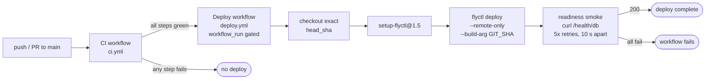

Purpose: run the Consumer Product Recalls API in production — the deploy pipeline and the operator runbook.

---

## Deploy Pipeline

Every push to `main` that passes CI automatically deploys to Fly.io. No manual promotion step exists.



### What each stage does

| Stage | File | Key behaviour |
|---|---|---|
| CI gate | `.github/workflows/ci.yml` | five-step quality gate — see [development.md § Quality Gate](development.md#quality-gate) for the full step sequence |
| Deploy trigger | `.github/workflows/deploy.yml` line 15 | `conclusion == 'success'` — red CI blocks deploy entirely |
| Checkout | `deploy.yml` line 24 | checks out `workflow_run.head_sha`, not HEAD, so the exact commit CI passed is what gets built |
| flyctl | `deploy.yml` line 25 | pinned to `superfly/flyctl-actions/setup-flyctl@1.5` |
| Remote build | `deploy.yml` line 27 | `flyctl deploy --remote-only` — Docker build runs on Fly's builder, not the Actions runner; `GIT_SHA` is baked into the image as the `GIT_SHA` env var (the ETag `startup_id`) |
| Readiness smoke | `deploy.yml` lines 32–40 | hits `https://consumer-product-recalls-api.fly.dev/health/db` (SELECT 1 probe); retries cover a cold-Neon wake returning 503 before Neon is ready |
| Concurrency guard | `deploy.yml` lines 18–20 | `group: deploy-production`, `cancel-in-progress: false` — no parallel deploys; an in-flight deploy is never cancelled by a new push |

### Manual deploy

```bash
flyctl deploy --remote-only
```

To deploy a specific prior SHA:

```bash
flyctl deploy --remote-only --image registry.fly.io/consumer-product-recalls-api:<sha>
```

To list and roll back to a prior release:

```bash
flyctl releases list
flyctl deploy --image registry.fly.io/consumer-product-recalls-api:<image-ref>
```

---

## fly.toml Configuration

Full file: [`fly.toml`](../fly.toml)

| Setting | Value | Reason |
|---|---|---|
| `app` | `consumer-product-recalls-api` | Fly app name |
| `primary_region` | `iad` | Co-located with Neon's AWS `us-east-1` (N. Virginia) to minimize DB round-trip |
| `auto_stop_machines` | `"stop"` | Scale-to-zero on idle |
| `auto_start_machines` | `true` | Machine wakes on first request |
| `min_machines_running` | `0` | True scale-to-zero; set to `1` to eliminate the app cold-start at the cost of ~$2/month |
| Concurrency type | `requests` | Fly adds a machine at `soft_limit` in-flight requests |
| `soft_limit` / `hard_limit` | `50` / `100` | Scale-out trigger / hard ceiling |
| Liveness check | `GET /health`, 15 s interval, 3 s timeout, 10 s grace | DB-free (see [Health vs Readiness](#health-vs-readiness) below) |

`ENVIRONMENT=production` and `LOG_LEVEL=INFO` are set in `[env]`. `NEON_DATABASE_URL_RO` is a Fly secret — see [Secrets](#secrets).

---

## Secrets

| Secret | Where it lives | How to set |
|---|---|---|
| `NEON_DATABASE_URL_RO` | Fly runtime secret | `flyctl secrets set NEON_DATABASE_URL_RO="postgresql+asyncpg://recalls_readonly:<password>@<host>/<db>?ssl=require"` |
| `FLY_API_TOKEN` | GitHub Actions — `production` environment | Set in repo Settings → Environments → production → Secrets |

Neither credential ever appears in `fly.toml`, the Dockerfile, or any committed file. The pipeline repo's `recalls_readonly` role provisioning is documented in the pipeline repo's `documentation/` directory.

For local development, copy `.env.example` to `.env` and fill in values — see [development.md](development.md).

---

## Health vs Readiness

The Fly liveness probe targets `GET /health`; the post-deploy smoke loop targets `GET /health/db`. For wire-level response shapes see [api-reference.md](api-reference.md#get-health); for design rationale see [decisions/0012-health-readiness-split.md](decisions/0012-health-readiness-split.md).

---

## Cold Start

Both the Fly machine and Neon compute can be asleep simultaneously. For wake-time characteristics, pool settings, and the boot-check behaviour, see [architecture.md](architecture.md) (db module row) and [ADR 0012](decisions/0012-health-readiness-split.md) (consequences section).

Operator guidance: a 503 from `/health/db` or any `GET /recalls*` request carries `Retry-After: 5`; retry after that delay. The post-deploy smoke loop in `deploy.yml` already does this (5 retries, 10 s apart). A keep-warm cron ping on a sub-5-minute interval prevents simultaneous cold starts.

---

## Cost

At current traffic (scale-to-zero):

| Item | Estimated cost |
|---|---|
| Fly machine (idle, rootfs storage only) | ~$0.03/month |
| Fly machine (shared-cpu-1x, always-on) | ~$2/month |
| Fly egress | ~$0.02/GB after 160 GB/month free |
| Neon (paid launch tier) | $25/month, mainly for compute usage |

To trade idle cost for latency, see the `min_machines_running` row in the [fly.toml Configuration](#flytoml-configuration) table above.

---

## Logs

The app writes structured JSON to stdout. Stream live with:

```bash
flyctl logs --app consumer-product-recalls-api
```

Every log line in a request context carries `request_id` (the `X-Request-ID` header value, minted by `RequestIdMiddleware` if the caller did not supply one). Use `request_id` to correlate request-access lines, query timing, and any error tracebacks for a single request.

Log renderer: JSON in production (`structlog` `JSONRenderer`). Console format is used only when `sys.stderr.isatty()` is true or `LOG_FORMAT=console` is set — neither applies on Fly.

v1 has no external APM or metrics pipeline. Observability beyond structured logs is deferred — see the pipeline ADR 0029 for the project's observability stance.

---

## Troubleshooting

| Symptom | Likely cause | Fix |
|---|---|---|
| `503` on data endpoints | Neon compute is asleep; `GET /health/db` also returns 503 | Retry after `Retry-After: 5` seconds; Neon typically wakes in 1–3 s |
| `503` persists after retries | Neon DSN wrong, role revoked, or pool exhausted | Check `flyctl logs`; verify secret with `flyctl secrets list`; confirm `recalls_readonly` role in pipeline repo |
| Boot log `RuntimeError: DB connection is NOT read-only in production` | DSN points to a write-capable role in production | Re-provision using the read-only DSN from the pipeline repo; `flyctl secrets set NEON_DATABASE_URL_RO=...` |
| Boot log `db.boot_check_skipped` | Neon was cold at startup | Benign; first request will either succeed (Neon woke) or 503 (still waking) |
| `429 rate_limited` | Per-IP rate limit exceeded | Client should back off; see [api-reference.md](api-reference.md) for the rate-limit convention |
| `422 invalid_parameter` | Bad query param value or unknown `Source` enum value | Check `error.detail` in the response body for the specific field; see [api-reference.md](api-reference.md) |
| `400 bad_cursor` | Cursor token is malformed or from a different endpoint shape | Discard the cursor and restart pagination from the beginning |
| OpenAPI snapshot drift fails in CI | `openapi.json` is stale after a code change | Run `uv run python -m recalls_api.export_openapi` locally and commit the updated file |
| Deploy job skipped after a push | CI is still running or failed | The `workflow_run` trigger only fires on `completed` + `conclusion == 'success'`; check the CI run first |

---

## Links

- [architecture.md](architecture.md) — system shape, request lifecycle, module responsibilities, read-only pool boot guard
- [development.md](development.md) — local setup, `.env` from `.env.example`, quality gate, git branching
- [data_contract.md](data_contract.md) — gold mart read contract, surrogate key recipes, data caveats
- [api-reference.md](api-reference.md) — per-endpoint params, error codes, pagination
- See [decisions/README.md — Upstream decisions (pipeline repo)](decisions/README.md#upstream-decisions-pipeline-repo) for Pipeline ADR 0024 (serving-layer API design), ADR 0025 (deployment target), ADR 0042 (gold serving marts read contract), and the `recalls_readonly` role provisioning ADR
